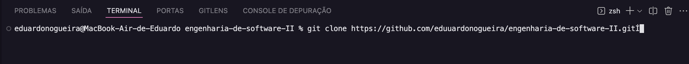
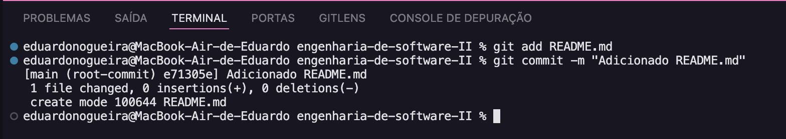
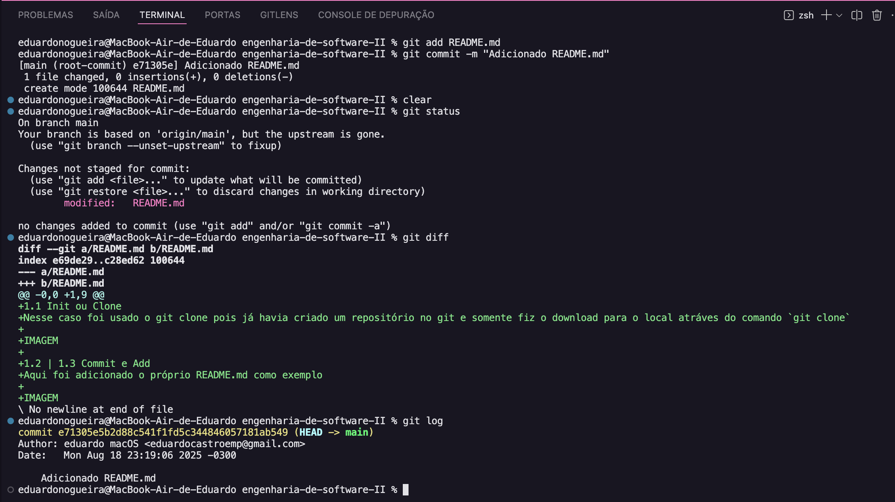
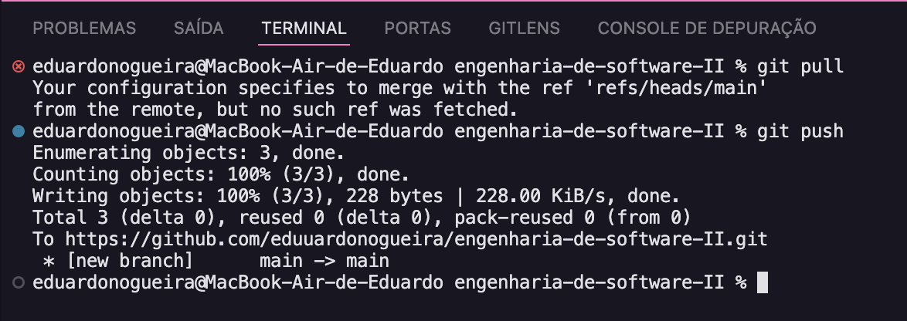
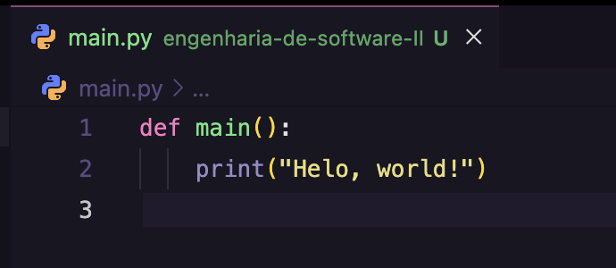
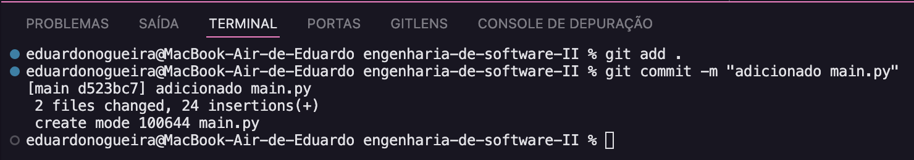
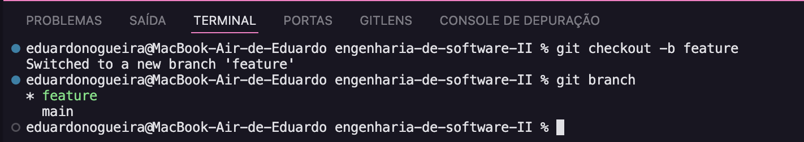
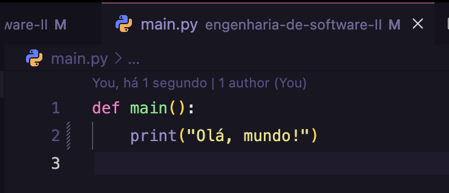
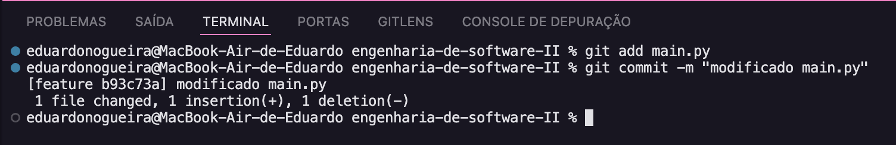
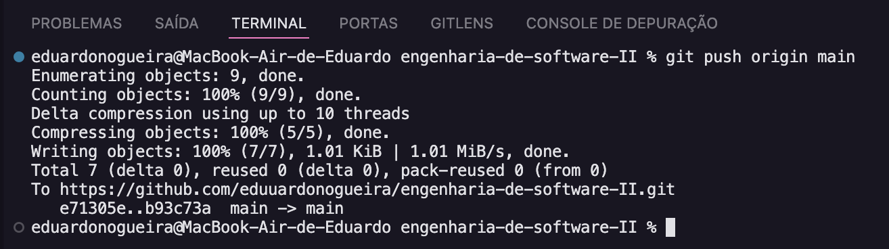

1.1 Init ou Clone
Nesse caso foi usado o git clone pois já havia criado um repositório no git e somente fiz o download para o local atráves do comando `git clone`

1.2 | 1.3 Commit e Add
Aqui foi adicionado o próprio README.md como exemplo

1.4 Status, Diff & Log
Nesse tópico, foi executado os comandos: `git status`, `git diff` e `git log``

1.5 Git Pull e Push
Foram executados o comando pull para sincronizar com o repositório remoto, logo após o comando push.

1.6 | 1.7 Confitos de merge e Branch
É bem dificil comentar em confllitos de merge sem comentar sobre branchs. Primeiro, na branch principal *main*, iremos adicionar um arquivo de código `main.py`:

Iremos adicioná-lo e commita-ló.

Agora, vamos criar outra branch e modificar o mesmo arquivo `main.py`.

Assim, vamos adicioná-lo e commitar em nosso branch `feature``

Dessa forma, vamos voltar a branch main `git checkout main` e agora fazer o merge das duas branchs, com o comando `git merge feature`.

Como visto acima, as alterações feitas na branch feature foram adicionadas na branch main.

1.8 Branchs remotos
Agora vamos enviar nosso código local para o respositório remoto. Basta digitar o comando `git push origin main`.

